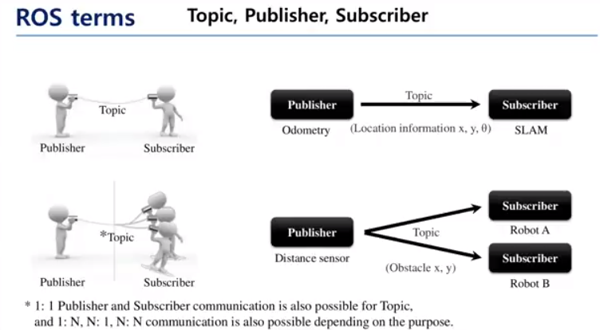

# Basics

## Node

- A node is the smallest executable process.
- It can be regarded as a single executable program.
- In a ROS system, we might have many nodes communication through messages.

## Package

- Box that contains one or more nodes with information for node execution.
- Many packages → Metapackages

## Message

- Data transmitted through MESSAGES between nodes.
- Messages can have many types.
- Messages can be structured (Mix of message architectures)

# Main communication Methods

## Topic message

## Topic

- Publisher sends MESSAGE to topic
- Subscribers read MESSAGE from topic

## Publisher

- A node that is sending a MESSAGE to a topic

## Subscriber

- A node that is reading MESSAGES from a topic

Ex: Reading sensor data

Steps for communication:

- Run master
- Run a node that subscribers to a specific topic
- Subscriber sends information to master node (Name, name of topic, type of message, port number)
- Run a publisher node with a specific topic
- Publisher sends information to master node (Name, name of topic, type of message, port number)
- If two topics are matched, ros master gives subscriber info about the publisher
- Subscriber tries to connect with publisher
- Publisher responds to request
- Connection is established
- Messages sent through this topic are broadcasted to the subscriber
- Connection lasts until connection is terminated

Example:

## Service message

Process that needs to communicate only once:

Client sends request to server

Server sends response to client

Ex: Starting a process

Steps for communication:

- Same as topic communication
- But connection terminates after communication is done (Just once)

## Action message

When client send request to server

Server keeps returning feedback until action is done

Ex: Parking a robot

## Parameters

