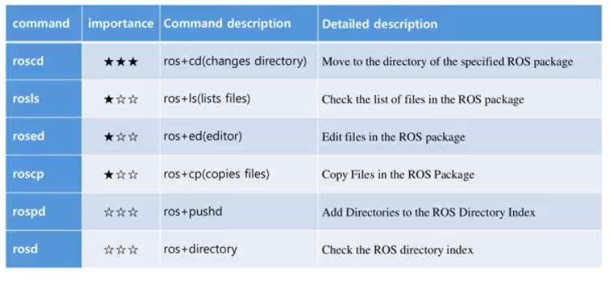

# Commands

## Shell commands

## Execution Commands

## Information Commands

## Catkin Commands

## Package Commands

## Notes:

- rosrun only launches one node
- roslaunch launches one or more node with roscore