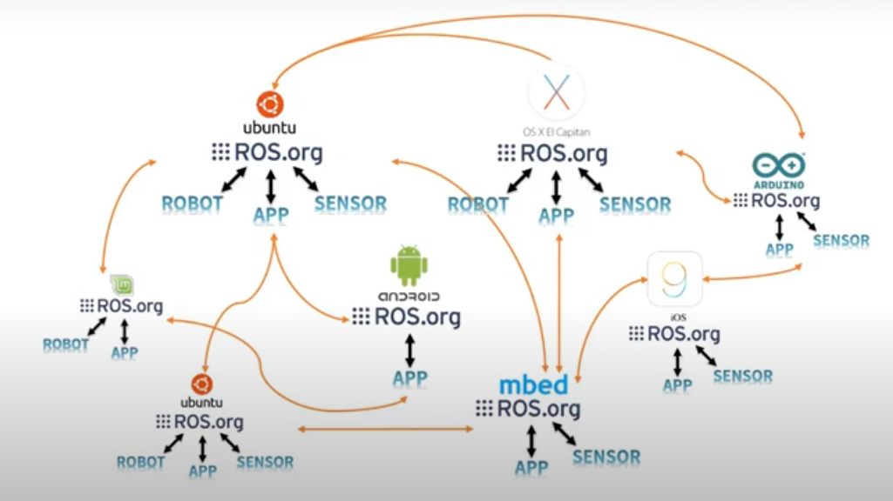

# Introduction

## Overview

ROS is a meta operating system, its main goal is to ensure communication between different components:

Traditional operation systems are able to run ROS (We usually use Ubuntu).

## Configuration

Here are the main configuration aspects:

## Ecosystem

## Main features

- Communication between ROS components/nodes is ensured through MESSAGE protocol (Each node can be coded in a different language). There are many standard message architectures.
- Many ROS tools:
    - Command line tools
    - RViz for visualization
    - Gazeboo for physics simulation
    - RQT for UI