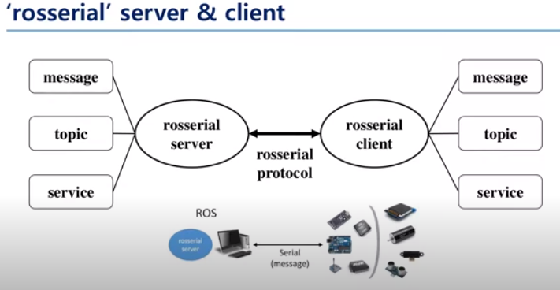

# Rosserial

To use MCU with ROS, we use Rosserial. Each embedded node is a rosnode.

Rosserial converts signals to allow communication with server nodes.

PC Side: Server node → rosserial-server

Microcontroller: Client node → rosserial-client

## Some limitations

